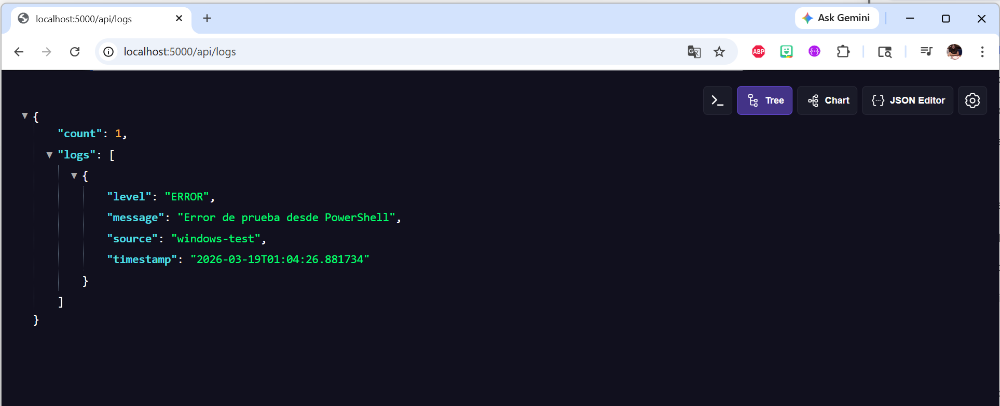
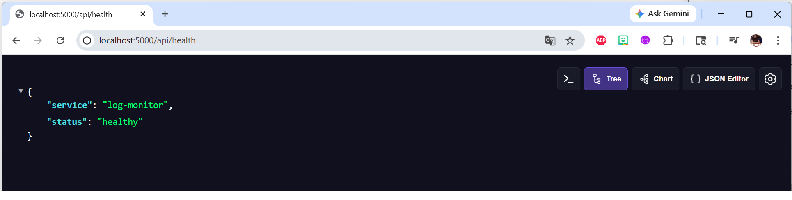
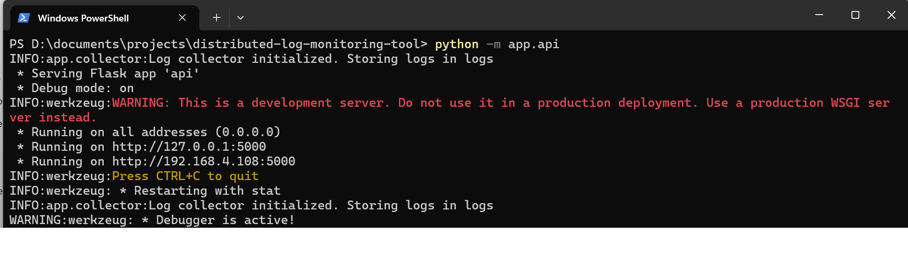
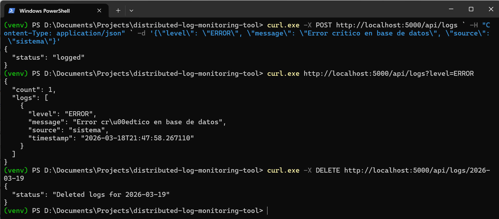
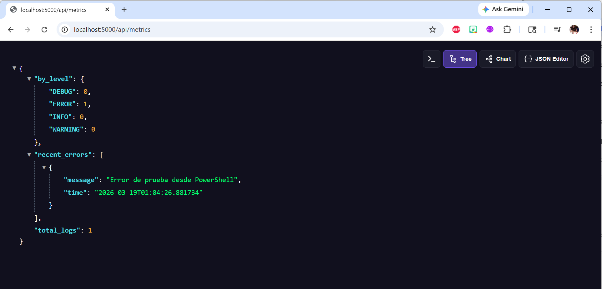

# Data Engineering & Analytics Portfolio

**Diana Araujo • Entry-Level Data Scientist • Data Analyst**

<p align="center">
  <a href="https://www.linkedin.com/in/dianadaraujo"></a>
  <a href="https://github.com/dianadesiree"></a>
  <a href="mailto:dianadaraujo78@gmail.com"></a>
</p>

---

## 🎯 About This Portfolio

Welcome to my data engineering portfolio! I'm an **Entry-Level Data Scientist / Data Analyst** with a B.S. in Computer Information Systems (GPA: 4.0) and an MBA in Information Systems Management in progress (GPA: 4.0).

This repository showcases my hands-on projects demonstrating:

- 🐍 **Python Development**
- 🔌 **API Design**
- 🐳 **Docker Containerization**
- 📊 **Log Analysis**
- 🔄 **Data Processing**
- ⚙️ **Automation Scripts**
- ☁️ **Cloud Technologies** (AWS/Azure)
- 📦 **Version Control with Git**

Each project includes code, documentation, and screenshots showing real functionality.

---

## 🚀 Featured Projects

### 📊 Distributed Log Monitoring Tool

*A Python-based solution for collecting, processing, and analyzing system logs through a RESTful API.*

#### ❓ The Problem
In production environments, logs are generated at high velocity and contain critical information for debugging and monitoring. Manual log analysis is inefficient and error-prone.

#### 💡 My Solution
I built a lightweight log aggregation service that receives logs from multiple sources, stores them efficiently, and exposes real-time metrics through a clean API interface. This project demonstrates skills directly applicable to my **Technical Operations Internship at Exostar**, where I analyzed system logs to identify patterns and troubleshoot issues.

#### 🛠️ Technologies Used

| Technology | Purpose |
|------------|---------|
| **Python 3.8+** | Core programming language |
| **Flask** | Web framework for REST API |
| **Docker** | Containerization and deployment |
| **Git** | Version control |
| **JSON** | Log storage format |

#### ✨ Key Features

- 📥 **Log Collection**: POST endpoint to receive logs from multiple sources
- 🔍 **Log Retrieval**: Query logs by date, level, and source
- 📊 **Metrics Generation**: Real-time statistics on error rates and log distribution
- 🗑️ **Log Management**: Delete logs by date for data retention
- 🐳 **Containerized**: Docker support for easy deployment

#### 📸 Demo Screenshots

<details>
<summary><b>👉 Click to see the API in action</b></summary>

| **API Running** | **Health Check** |
|:---:|:---:|
|  |  |
| *Flask server running locally* | *Simple endpoint to verify service status* |

| **POST Request - Sending Logs** | **GET Request - Retrieving Logs** |
|:---:|:---:|
|  |  |
| *Sending structured log data via curl* | *Querying logs filtered by ERROR level* |

| **Metrics Response** |
|:---:|
|  |
| *Real-time statistics showing log distribution by level* |

</details>

---

## 📋 How to Run the Project

### Prerequisites
- Python 3.8 or higher
- Git
- Docker (optional)

### Step-by-Step Instructions

1. **Clone the repository**
   ```bash
   git clone https://github.com/dianadesiree/distributed-log-monitoring-tool.git
   cd distributed-log-monitoring-tool
2. **Install dependencies**
   ```bash
   pip install -r requirements.txt
3. **Run the API**
    ```bash
    python -m app.api
4. **In another terminal, test the API**
   ```bash
   curl http://localhost:5000/api/health

#### 🔧 Upcoming Projects

| Project | Technologies | Status |
|------------|---------|----------|
| **System Automation Scripts** | Python, PowerShell, Bash | ⏳ In Progress |
| **Cloud Infrastructure Labs** | Azure, AWS, Docker | ⏳ In Progress |
| **Data Analysis Portfolio** | Pandas, SQL, Jupyter | 📅 Planned |

#### 🛠️ Technical Skills

| Category | Technologies |
|------------|---------|
| **Languages** | Python, SQL, R, Java, C#, JavaScript, Bash, PowerShell |
| **Data Analysis** | Pandas, NumPy, Data Cleaning, EDA, Visualization |
| **Databases** | MySQL, PostgreSQL, MongoDB, NoSQL |
| **Cloud & DevOps** | AWS (Cloud 101), Azure (VMs, AKS), Docker, CI/CD, Agile, Scrum |
| **Tools** | Git, GitHub, Postman, Jupyter Notebooks |

## 🎓 Education & Certifications

### Education

| Degree | Institution | GPA | Status |
|--------|-------------|-----|--------|
| **MBA - Information Systems Management** | Keller Graduate School of Management | 4.0 | In Progress (Expected 08/2027) |
| **B.S. - Computer Information Systems** | DeVry University | 4.0 | Completed 08/2024 |
| **A.A.S. - Information Technology & Networking** | DeVry University | 4.0 | Completed 08/2023 |
| **A.A.S. - Education** | Lord Fairfax Community College | 3.67 | Completed 08/2021 |

### Certifications

- ✅ **Getting Started with Git and GitHub** - IBM
- ✅ **ServiceNow System Administrator** - Packt
- ✅ **Introduction to Agile Development and Scrum** - IBM
- ✅ **Introduction to Cloud Computing** - IBM
- ✅ **AWS Educate: Introduction to Cloud 101** - Amazon Web Services
- ✅ **Foundational C# with Microsoft** - freeCodeCamp
- ✅ **Deploy Containers Using Azure Kubernetes Service** - Microsoft

## 📬 Let's Connect!

I'm actively seeking **Entry-Level Data Scientist / Data Analyst** opportunities. If you'd like to collaborate or discuss potential projects:

| | |
|---|---|
| 📧 **Email** | [dianadaraujo78@gmail.com](mailto:dianadaraujo78@gmail.com) |
| 🔗 **LinkedIn** | [linkedin.com/in/dianadaraujo](https://www.linkedin.com/in/dianadaraujo) |
| 🌐 **Portfolio** | [dianadesiree3.wixsite.com/my-site](https://dianadesiree3.wixsite.com/my-site) |
| 🐙 **GitHub** | [github.com/dianadesiree](https://github.com/dianadesiree) |

---

<div align="center">
  <br>
  
  <br><br>
  
  ⭐️ **If you find my projects helpful, please consider giving them a star!** ⭐️
  
  <br>
  <sub>© 2026 Diana Araujo. All rights reserved.</sub>
</div>
